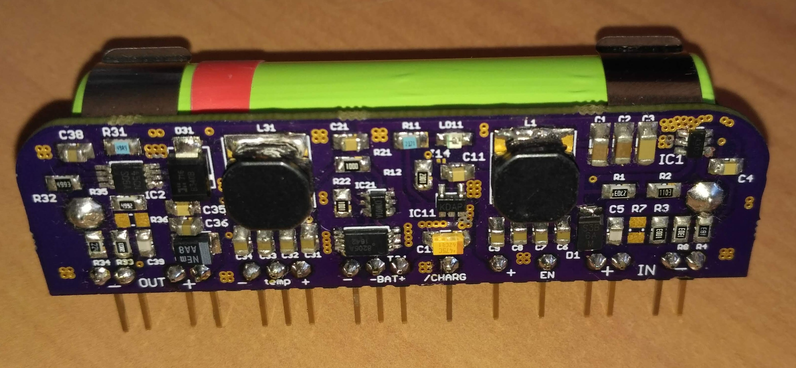

# BackupPowerSupply
Module for backup power supply with 18650 - Li-ion battery

##Parameters
Input voltage: 5-24V

Output voltage Normal State: 4.4V

Output voltage Battery State: 4.3V

Max Current: 1A

##Used components
TPS54302 - Step-Down Converter (Input 4.5V-28V), Integrated MOSFETs for 3A continuous output current

LM2621 - Step-Up Converter (Input 1.2V-14V), Switch Current Limit 2.8A, Max switching frequenc 2MHz

MCP73831 - Single Cell Li-Ion Charge Management 

DW01 - Li-Ion Battery Protection
